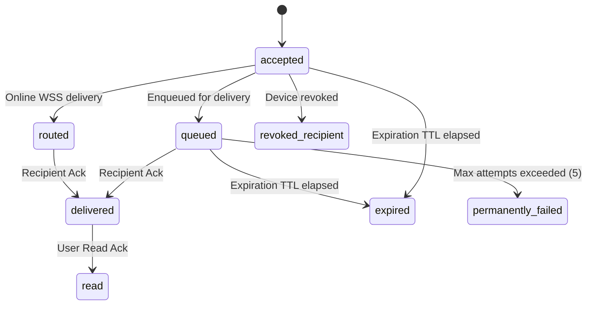

# GuffSuff Delivery State Machine Specification

> **Document Status**: Phase 5 State Machine Standard

---

## 1. Monotonic Delivery States

Delivery status is tracked independently for each recipient device record in `message_recipient_devices`:

- `accepted`: Envelope received and validated by API gateway.
- `queued`: Enqueued for offline retry or worker delivery.
- `routed`: Dispatched to active WebSocket connection.
- `delivered`: Explicitly acknowledged by recipient device (`POST /api/v1/envelopes/:id/delivered`).
- `read`: Explicitly marked read by recipient user (`POST /api/v1/envelopes/:id/read`).
- `expired`: Omitted from delivery due to timestamp exceeding `expiresAt`.
- `revoked_recipient`: Omitted because recipient device was revoked prior to delivery.
- `permanently_failed`: Terminal failure state after exceeding max retries.

---

## 2. Transition Rules

