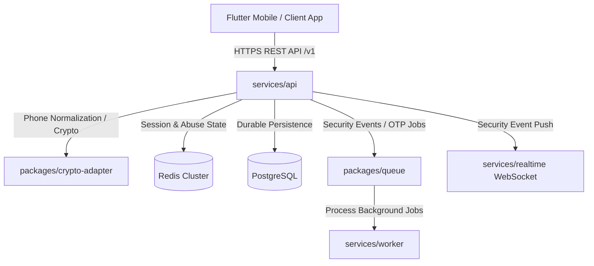

# GuffSuff Identity Architecture & System Specifications

## 1. Overview

GuffSuff Identity Foundation manages user authentication, phone normalization, OTP challenge/verification, account registration, profiles, usernames, rotating sessions, device management, privacy settings, security events, and registration lock PINs.

## 2. Component Boundaries

- `services/api`: Synchronous identity operations, REST controllers, JWT generation/validation, session checks.
- `services/worker`: Asynchronous background jobs for OTP delivery retries, security event notifications, session cleanup.
- `services/realtime`: Realtime WebSocket notifications for device revocation, session revocation, and security alerts.

## 3. Data Protection

- **Phone Numbers**: Encrypted using AES-256-GCM (`phone_encrypted`), searched via HMAC-SHA256 blind index (`phone_blind_index`). Plaintext E.164 is never logged or stored.
- **OTPs**: HMAC-SHA256 verifiers using server pepper. Never stored in plaintext.
- **Refresh Tokens**: Opaque random strings, stored as SHA-256 hashes in `refresh_tokens`.
- **Registration Lock PIN**: Hashed with Argon2id + server pepper (`m=65536, t=3, p=4`).
