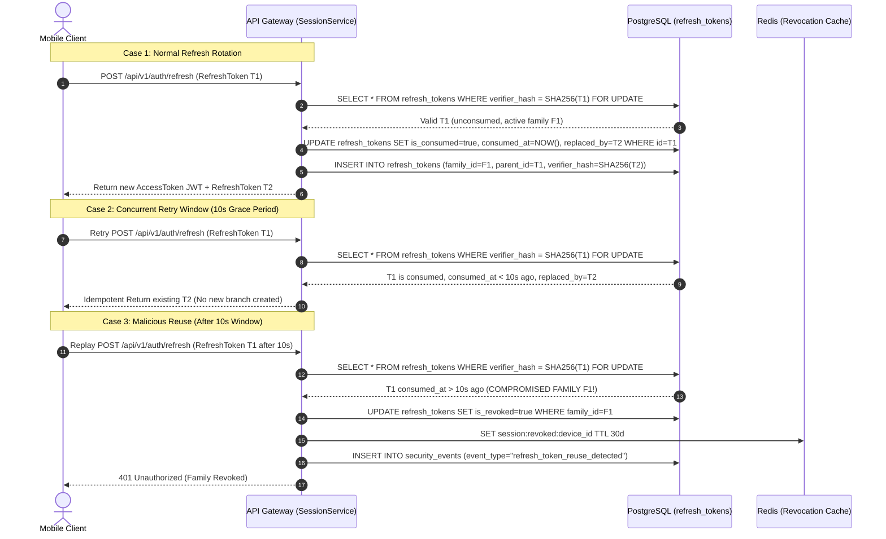

# GuffSuff Session Security & Token Management Specification

> **Document Status**: Phase 5 Security Architecture Baseline  
> **Rule**: Raw refresh tokens MUST NOT be stored in backend databases. Storage uses SHA-256 token verifier hashes (`SEC-SESSION-001`).

---

## 1. Token Lifecycles & Constraints

- **Access Token (JWT)**: Ephemeral lifetime of **15 minutes** (900 seconds). Contains `sub` (userId), `deviceId`, `iss` (`guffsuff-api`), `aud` (`guffsuff-mobile`), and `exp`.
- **Refresh Token**: Lifetime of **30 days**. Issued as cryptographically secure 256-bit random string (`opaque_refresh_token`). Backend stores `SHA-256(opaque_refresh_token)` in `refresh_tokens` table.
- **Refresh Token Rotation**: Every call to `/api/v1/auth/refresh` invalidates the old refresh token and issues a new refresh token pair.
- **Reuse Detection**: If a previously consumed refresh token is presented outside the 10-second network concurrency window, the server flags a replay attack, immediately revokes all tokens in the family, and emits security event `SEC_EVENT_REFRESH_TOKEN_REUSE`.

---

## 2. Refresh Token Concurrency & Reuse Detection Sequence Diagram

---

## 3. Concurrency Invariants & DB Authority

1. **Single Authoritative Lineage**: A token family `family_id` maintains one primary chain. Branching is prohibited.
2. **10-Second Concurrency Window**: Retries within 10s of rotation return the previously issued child token `replaced_by` rather than creating a new lineage.
3. **Database Transaction Lock**: All token updates execute inside PostgreSQL `BEGIN ... FOR UPDATE ... COMMIT` transactions to eliminate application-level race conditions.
4. **Immediate Invalidation on Revocation**: Device revocation or `logout_all` invalidates all families owned by the target session in DB and Redis.
